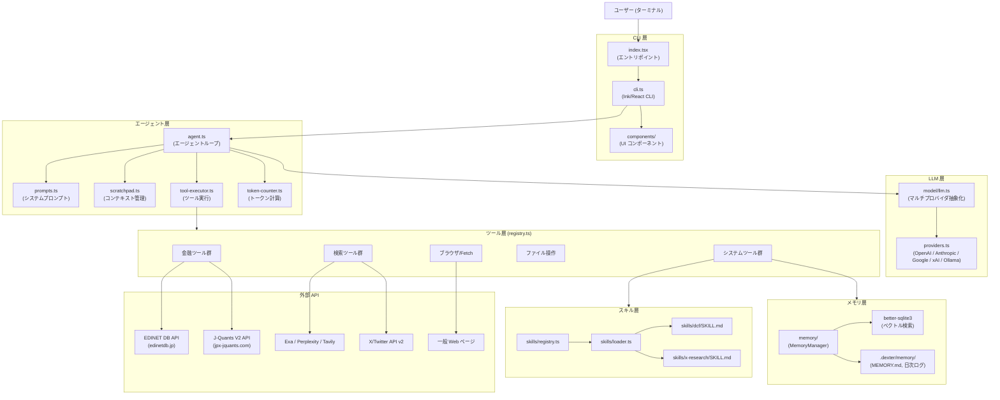
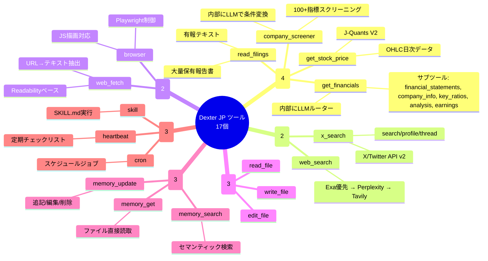
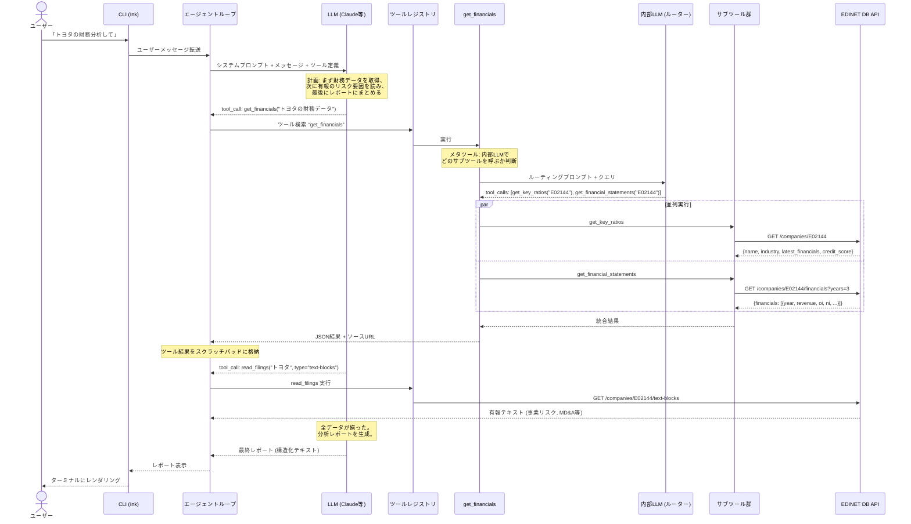

# Dexter JP アーキテクチャ

## 1. 全体構成図

## 2. ツール分類マップ

## 3. データフロー例: 「トヨタの財務分析して」

### フロー解説

1. **ユーザー入力**: CLI (Ink) がターミナルで入力を受け取る
2. **エージェント判断**: LLMがシステムプロンプトとツール定義を参照し、必要なツールを選択
3. **get_financials (メタツール)**: 内部にもう1つLLMを持ち、クエリに応じてサブツール (key_ratios, financial_statements, analysis, earnings, company_info) を自動選択・並列実行
4. **read_filings**: 有報のテキスト部分（事業リスク、経営分析など）を取得
5. **レポート生成**: 全データを統合し、構造化された分析レポートを出力

重要なのは「エージェントが自分で計画を立て、複数ツールを順序立てて呼び出す」点。ユーザーは1回質問するだけで、裏側では複数のAPI呼び出しが自律的に実行される。
